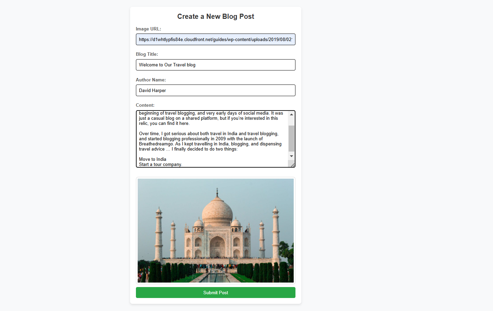

# Blog Website

A simple blog website built using **RESTful API, EJS, HTML, and CSS**. Users can add and view blogs.

## Preview

## Features
- Add new blog posts
- View existing blog posts
- Styled using HTML and CSS
- Uses RESTful API for backend communication

## Installation

1. Clone the repository:
   git clone https://github.com/siddhiii01/blog-website.git
   cd blog-website
2. Install dependencies:
   npm install 
3. Start the server using nodemon:
   nodemon index.js
  
  If you don’t have nodemon installed, install it globally first:
  npm install -g nodemon
4. Open your browser and go to:
   http://localhost:8080/post

## Technologies Used
- Express.js (Web Framework)
- EJS (Template Engine)
- HTML & CSS (Frontend Styling)
- RESTful API (Communication)